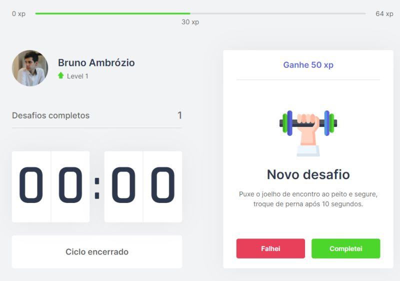

# MoveIt

# Sobre o projeto
O moveit é uma aplicação desenvolvida durante a 4ª Next Level Week da Rocketseat tendo em vista o funcionamento da técnica de <a href="https://www.napratica.org.br/pomodoro/">Pomodoro</a>.
A cada 25 minutos, um desafio será proposto para o usuário, com intuito de manter seu corpo e mente saudáveis entre períodos de foco e concentração. Ao completar desafios, o usuário subirá de nível! 



# Tecnologias
No desenvolvimento deste projeto, as seguintes tecnologias foram utilizadas:

- [React](https://reactjs.org/)
- [Next.js](https://nextjs.org/)
- [TypeScript](https://www.typescriptlang.org/)

# Utilizando o projeto

```bash
# Clone o projeto em uma pasta local
$ git clone https://github.com/brunoambr/moveit.git

# Acesse a pasta com o projeto
$ cd moveit

# Instale as dependências do projeto
$ yarn

# Inicie o projeto
$ yarn dev
```

# Preview
Você pode ver o funcionamento do projeto em:

https://moveit-brunoambr.vercel.app/